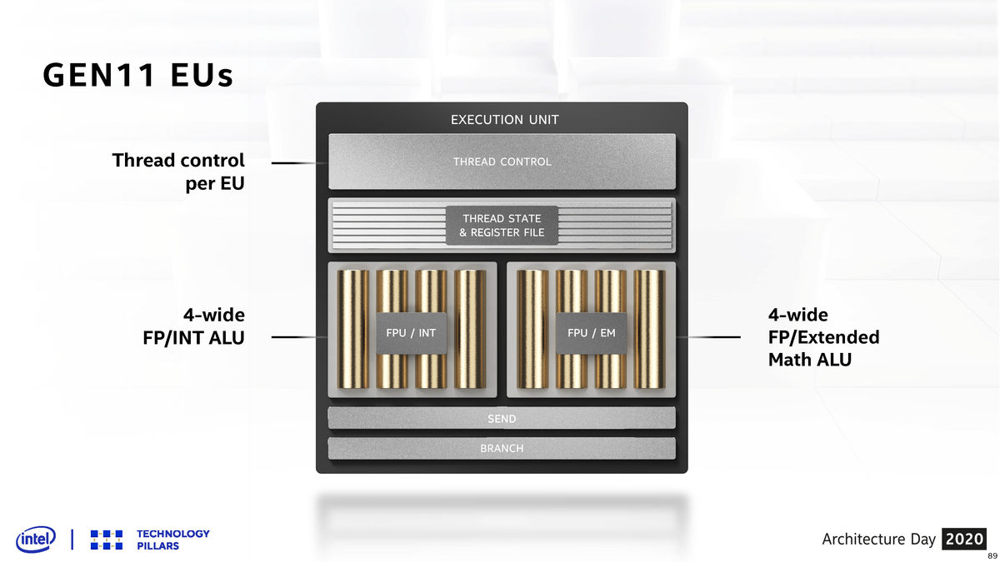
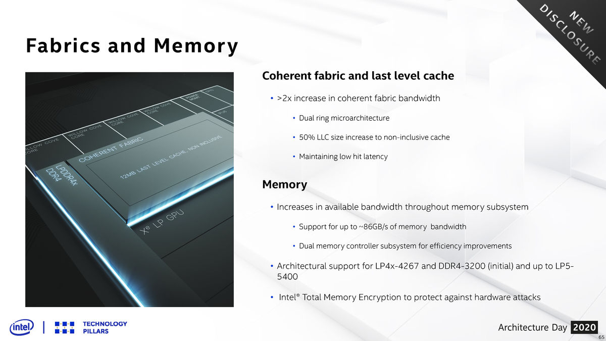

# 看Intel如何在移动端找回场子：Tiger Lake平台解析

2020年对于Intel来说，并不是一个很好的年份。上半年，他们的消费级处理器业务遭遇了前所未有的严峻挑战，先不说桌面级，就是向来有非常大优势的移动处理器在竞争对手的新产品面前也展现不出原来的风采。下半年伊始，官方又公布了7nm制程延迟的不利消息，股价一路下跌。Intel现在急需一款能够提振消费者信心的产品，随着时间进入到今年的第三季度中后期，他们已经准备好将新一代移动处理器——Tiger Lake推向市场了。

在今年CES大展的主题演讲活动上，Tiger Lake是作为Intel的压轴产品登场亮相的，可以说他们对这代移动处理器是寄予厚望的。前不久，他们向媒体发出了邀请函，并很快确认了会在9月2日正式发布Tiger Lake这套全新移动平台。那么Tiger Lake究竟有哪些改变呢？为什么Intel会花这么大的力气去宣传这套新平台呢？本文就结合最近Intel官方给出的信息和其他渠道得到的内容，为大家解析一下Tiger Lake。

# Tiger Lake是什么？

在开始对Tiger Lake进行全面解析之前，我们有必要在宏观层面上了解一下Tiger Lake。Tiger Lake是Intel新一代移动平台的代号，是Ice Lake的接任者，其正式的产品归属在第11代酷睿家族中。Tiger Lake仍然是一枚SoC，主SoC和PCH两枚芯片封装在同一块基板上面，使用OPI总线进行互联。

主SoC中，集成了CPU、GPU、IO单元、内存控制器、图像处理器和AI加速器等单元。接下来，我们将盘点Tiger Lake平台的主要改动，从进步极大的制程工艺开始说。

# 10nm SuperFin制程与更高的主频

大家都知道，Intel的10nm制程卡了很多年，致使原本规划好的产品多次延期，在去年八月的时候，Intel终于向市场推出了Ice Lake这个首款10nm制程处理器，但刚推出的那段时间可以说出货量仍然受制于制程良率等问题，不是很高。并且Ice Lake的性能表现明显被制程工艺给限制住了，过低的基础频率、过高的发热影响到了它的发挥。

经过一段时间的优化调整，Intel在Tiger Lake上将启用新的10nm SuperFin（以下简称10nm SF）制程，它其实就是之前宣传时候用的10nm+制程，不过为了避免混淆，Intel给它起了个新的名字。

新的10nm SF主要调整了FinFET晶体管的几个物理特性，并改良了制造工艺、引入了SuperMIM和新的阻隔材料等，种种改良使得10nm SF的晶体管能够承受更高的电流，同时有更好的性能。经过调整之后的10nm SF可以让Tiger Lake的主频上到更高的水平。

在新工艺的帮助下，Willow Cove内核的电压-频率曲线好看了不少，在同样电压下它能够上到更高的频率，而且它还能够承受更高的电压，最高频率比使用老工艺的Sunny Cove高出不少。

如果直接拿目前泄漏出来的频率信息来对比的话，TDP同为28W的Core i7-1068NG7和Core i7-1165G7，后者的基础频率高了500MHz，最高的睿频可以去到4.7GHz，比前者高出600MHz。另外Intel还在Tiger Lake处理器阵容中规划了更为高端的Core i7-1185G7，其拥有更高的频率。

新工艺带来的当然不仅仅是峰值频率的提升，还改善了处理器频率的稳定性，从上面这张图中可以看到，Willow Cove的平均频率明显要比Sunny Cove要高出一个档次，内核掉到最低频率的次数也少了很多。

在AMD率先在低压端推出8核处理器之后，Intel这边因为各种原因很难在核心数量上进行跟进，那么主频就是用来拉近距离的武器了，在10nm SF的加持下，Tiger Lake的单核性能肯定会有一定的提升，而多线程也能拉近一定的距离，但在多出一倍的核心数面前还是难以匹敌。

# Willow Cove内核微架构

除了借助制程进步提升了CPU的频率外，Tiger Lake也继续对内核微架构进行调整升级。在Sunny Cove拨动了Intel处理器上多年未变的IPC指标后，Willow Cove将接过棒，继续拉高自己的单核性能。Willow Cove的内核微架构基于Sunny Cove，是后者的改良版，其中最大的改变点在于它的缓存系统。

在Willow Cove上，Intel放弃了沿用多年的包含式L2缓存（L2缓存中包含L1缓存的数据），换用了非包含式的结构，同时将它的容量大小从原本的512KB提升到1.25MB，猛增150％。更大的缓存意味着缓存命中率会有提高，2.5倍的大小会让L2缓存的miss机率降低约58％，对单核性能会有很大的帮助。另外非包含式的缓存因为不用做验证了也会带来一定的性能提升。

但是容量越大的缓存其访问延迟会更高，为了平衡掉延迟增加带来的性能损失，Intel将访问带宽从原本的8路扩到了20路，用增多每次访问的数据量去抵消访问延迟增加带来的性能损失。而核心间共享的三级缓存也同样改成了非包含式的，大小则是从每核心2MB增加到每核心3MB，总计12MB，不过访问带宽被砍到了12-way，这意味着在Tiger Lake上，访问三级缓存将会变得更慢，而且访问带宽会变小。

为什么Tiger Lake不集成更多的Willow Cove核心呢？因为大容量的SRAM会占据掉很多核心面积，单个Willow Cove内核的面积应该比Sunny Cove要大不少，加上新的面积贼大的X^e^-LP GPU，如果为了放入更多的核心再扩大Die的面积，那么良率会很难看。

其他方面的改动主要有安全特性的更新，最近几年Intel的处理器一直有曝出各种漏洞，最为主要的还是针对分支预测器的攻击，于是Willow Cove在内核层面上引入了新的安全特性，也就是控制流执行（**C**ontrol-Flow **E**nforcemen**t**）。

CET通过在内存中建立一个影子堆栈来保护原始内存堆栈，同时CET还会实行间接分支跟踪，以防御恶意指向的跳转或调用目标，它有希望在硬件层面上防范掉一系列恶意攻击，不过需要软件支持。

相比起Skylake到Sunny Cove，Willow Cove的变化小了很多，大部分结构直接保留了Sunny Cove的，前端中部和后端都没有什么变化，所以它的IPC提升应该是不大的，其性能提升基本上是来自制程工艺给到的更好的频率表现。

# X^e^-LP GPU架构

如果说CPU内核微架构的改良算是小菜的话，那么Tiger Lake引入全新的X^e^-LP GPU可以说是它身上最大的变化了。是的，图形性能是Tiger Lake关注的重点，开发多年的X^e^架构将会在Tiger Lake上首次出演。

X^e^-LP架构是X^e^架构中面向于移动产品的变种，架构的主要关注点是能效比，也就是要在尽量低的能耗下提供尽量强的性能。本次架构日活动上面，官方带来了X^e^-LP架构的具体细节，在这里我们需要对比上一代核显架构来分析它的变化。

Tiger Lake集成的X^e^-LP GPU拥有96组EU单元，在规模方面较上代核显大了50％。

类似于另外两家的GPU架构，Intel的GPU架构也有层级之分，最上层的被称之为Slice。每个Slice都有完备的计算和渲染能力，它包含有几何和光栅前端、线程分配单元、执行单元、材质单元和ROP后端。X^e^-LP的单个Slice规模比上代扩增了50％，因此，不止是EU，几乎是所有单元的数量都多了50％，不过前端部分没有变化。

在单个Slice之下是Subslice单元，X^e^-LP的单个Slice含有6个Subslice单元，它的概念比较类似于NVIDIA的SM和AMD的CU。X^e^-LP GPU的单个Subslice单元中含有16个EU。

我们继续深入，来看到EU的内部。在上代核显上，一个EU内部有一个线程控制单元，它指挥一组4+4宽度的ALU，其中右边这个ALU还需要负责扩展数学指令的运算。如果遇到相应指令，那么会阻塞掉浮点指令的计算。

那么在X^e^-LP上，Intel大刀阔斧的对EU内部进行了调整，首先原本一对一的线程控制单元现在变成一对二了，也就是一个线程控制单元实际要负责两个EU的任务。再往下，到具体的ALU上面，现在每个EU中含有8个用于处理浮点或整数指令的ALU，另外还有两个只针对扩展数学指令的ALU，从原本的4+4结构变成了8+2，而且两种类型的指令可以并行处理了。

看完EU内部发生的变化，再来说说新GPU的缓存系统。

X^e^-LP为每个Subslice设计了独立的L1数据缓存和纹理缓存，这是全新的特点。另外GPU有独立的16MB L3缓存，这个容量可以说是非常大了。另外，为了满足核显对内存带宽的高需求，Intel把原本的单环Ringbus改成了双环Ringbus，其带宽增加了一倍。

配合10nm SuperFin工艺在频率上的提升，新的核显有着更高的能效表现，如图所示，它能够接受更广的电压范围，还能上到更高的频率，这也是新核显有更强性能的一个原因。在官方的宣传中，新的核显能够提供多一倍的图形性能，不过具体到游戏表现上，还是要看软件优化做的怎么样了。

关于X^e^-LP的更为详尽的解析，我们会另开一篇文章。

# 显示输出和媒体引擎增强

X^e^-LP GPU还带来了加强过的显示引擎和媒体引擎。

显示引擎方面，有四条4K分辨率级别的处理管线，支持两条eDP，外部输出接口则是支持DisplayPort 1.4和HDMI 2.0，当然，具体的输出接口可以是DP和HDMI，也可以是USB-C。其他像是8K输出、HDR10、Dolby Vision、12-bit BT2020色域和自适应同步都有支持，对显示器的刷新率，最高可以支持到360Hz。这里很可惜的是，我们没能见到原生的HDMI 2.1支持，厂商可能会通过转接芯片去做支持。

媒体引擎方面，整个处理管线的编解码性能提升了一倍，色深的支持升级到了12-bit，并且能够支持HDR/Dolby Vision的回放。这里还有一个亮点是对AV1做了硬件解码支持，这是一个面向于未来的特性。

# IO大升级

作为一枚SoC，它自然是包含了各种IO控制单元，Tiger Lake在这方面也有较大的提升，主要有PCIe 4.0支持、Thunderbolt 4支持和USB4支持等几点。

## PCIe 4.0 x4

长久以来，Intel的移动低压处理器并不提供直连SoC的PCIe总线，外围PCIe设备都是连接到PCH，然后通过OPI总线与SoC进行互连的。但OPI总线那点可怜的带宽放到今天实在是不够用了，所以Intel终于给移动低压处理器做了直连SoC的PCIe总线，一做就是4.0版本的，这也使得Tiger Lake成为了Intel首颗支持PCIe 4.0的处理器。官方并没有给出Tiger Lake上具体有几条直连SoC的PCIe总线，不过从8GB/s这个数据来看，应该是4条。

有直连SoC的PCIe总线意味着部分对带宽有高要求的外围设备能够发挥出更好的性能水平，比如说独立显卡，比如说PCIe 4.0的SSD，总之，这4条总线的作用还是很大的。

## Thunderbolt4 & USB4

然后是USB4和Thunderbolt 4的整合，去年Intel在Ice Lake上面首次将Thunderbolt控制器整合到了SoC上，从此Thunderbolt设备就直接连到SoC上，而不是绕PCH。对于一些很吃延迟和带宽的外接设备，直连能够带来可观的性能收益，关于这点我们在之前的显卡扩展坞测试中提过。相比起前代，Thunderbolt 4并没有在速率上有任何的提升，Tiger Lake仍然是会在笔记本的每侧提供一个40 Gbps的Thunderbolt 4接口。Intel还在新的移动超能机型认证中加入了快充的要求，想要通过认证的笔记本就必须要有一个支持快充技术的Thunderbolt 4接口。而USB4的支持则是让Tiger Lake有更好的兼容性，虽然到目前为止市场上还没有出现任何USB4设备，但早做准备总归是不会错的。

# 其他改动

## 内存支持LPDDR5

内存控制器方面，Tiger Lake仍然支持DDR4-3200，对LPDDR4X的支持提升到了LPDDR4X-4266的水平，除了支持这两种现在很常见的DRAM之外，Tiger Lake还预留了对LPDDR5的支持，能够支持LPDDR5-5400。在内存支持规格有提升以外，Tiger Lake的内存控制器还支持全内存加密特性，能够抵御硬件攻击。

## 内部互联改用双环

从Sandy Bridge开始，Intel在消费级处理器上一直都是用Ringbus环状总线做内部互联的，它的带宽非常高，在核心数量不是很多的情况下能够提供很低的核心间通讯延迟。此次Tiger Lake上，因为核显的增强，其对带宽的需求增加了许多，为了满足它的需求，Intel做了一个双环Ringbus，直接把带宽增加了一倍。

## 功耗管理

移动平台是一个对功耗非常敏感的平台，所以每代移动平台在功耗管理上都会做出改进，以适应新的应用场景。

Tiger Lake的功耗管理单元更新了动态电压和频率调节算法，另外现在SoC上的IO单元也能够独立地进行睡眠。总的来说，Tiger Lake将会更为省电，具体到产品表现上，续航将有一定的延长。

## GNA 2.0和IPU6

在已经进入到AI时代的大背景下，移动SoC厂商们纷纷在自己的产品上加入了NPU等单元来加速AI推理等运算，Intel在Ice Lake上首次置入了一个名为GNA的加速单元，它能够针对部分AI应用进行加速，Tiger Lake上，这个单元升级到了2.0版本。

在笔记本上面，GNA单元主要被用于处理语音识别，官方给出的数据表示，GNA 2.0单元在1mW的功耗下能够提供1 GigaOP的性能，由于没有Ice Lake的对比数据，也不清楚2.0的升级幅度有多大。

另外一直存在于Intel SoC上的一个默默无闻的单元就是图像处理单元（IPU），Tiger Lake集成了第六代IPU，依旧支持6个传感器，但是在规格上能够支持4K90的视频和4200万像素图片的处理。不过呢，这是未来Tiger Lake-H上面的IPU规格，目前的Tiger Lake-U系列只能够支持4K30的视频和2700万像素的照片。

# 产品

Tiger Lake的具体产品覆盖范围还是比较广的，在移动低压端Intel规划了Tiger Lake UP3和UP4两个系列，在标压端则是规划有Tiger Lake-H。在9月2日正式发布之后，我们看到的首批搭载Tiger Lake的笔记本应该都是使用UP3或UP4的轻薄本。而标压……从目前的消息来看，真正的Tiger Lake-H还是遥遥无期的，我们首先见到的可能是将TDP拉到35W的Tiger Lake UP3。

首批上市的Tiger Lake处理器有7款，另外2款4核的i3型号会在明年出货。Tiger Lake-UP3的旗舰型号为Core i7-1185G7，单核最高睿频为4.8GHz，全核最高睿频为4.3GHz，而次旗舰Core i7-1165G7则是砍了最高单核频率、最高睿频和GPU的频率。i5型号仍保留了4核8线程，但EU数量被减少到80个，另外缓存也从i7的12MB砍到8MB，最高单核睿频从4.8GHz、4.7GHz大幅下降到4.2GHz，不过全核睿频缩水幅度一般。

首批搭载Tiger Lake的笔记本应该会在今年九、十月份大量发布，国内有望赶在双十一节点前大量上市（只要Intel供应没问题的话）。

而标压处理器则是要等到明年，就目前的消息看，Intel将会首先推出一批“假标压”，即将目前的Tiger Lake-UP3的TDP拉高到35W，而核心数方面并没有任何改动。真正的标压处理器可能要等到明年下半年才会正式登场。

# 总结

Tiger Lake使用着Ice Lake打好的框架，同时又对这个框架的每一处进行了改良。如果说Ice Lake是一代有野心但受到各种限制而没有太成功的产品，那么Intel在Tiger Lake上可以说是寄予了厚望，从对它的宣传上也可以看出一些踪迹——在CES上压轴登场，官方多次预热它，甚至还要为它举办一场专门的发布会。

那么如此之多的改进能够让Intel在移动端找回自己的场子呢？这并不好说，还是要拿产品的实际表现来看。就算是Tiger Lake在上市后能压过风头正盛的Renoir一头，但AMD那边很快就要推基于Zen 3的Cezanne APU了，到时候Tiger Lake还能撑得住吗？

我们还是从积极一点的角度来看Tiger Lake，它的推出标志着Intel 10nm工艺的成熟，虽然不知道具体的良率情况，但至少频率方面是有希望了，让等待10nm桌面处理器的我们看到了曙光，而新内核微架构和新GPU架构的应用也让我们看到了Intel仍然在按自己的脚步往前走。虽然情况有些不利，但Intel还在坚持。

本文内容基于Intel官方文档、AnandTech解析文章和其他一系列资料写就。并不包含实际产品的测试内容，如果对Tiger Lake的实际性能表现感兴趣，建议阅读金猪老师的：《[实用至上主义：英特尔11代酷睿Tiger Lake-U评测](https://zhuanlan.zhihu.com/p/185683069)》